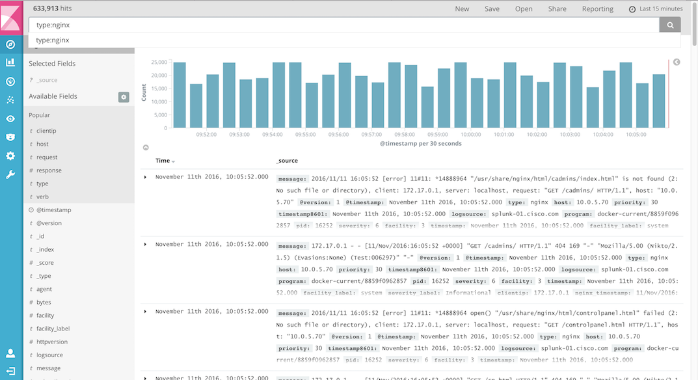
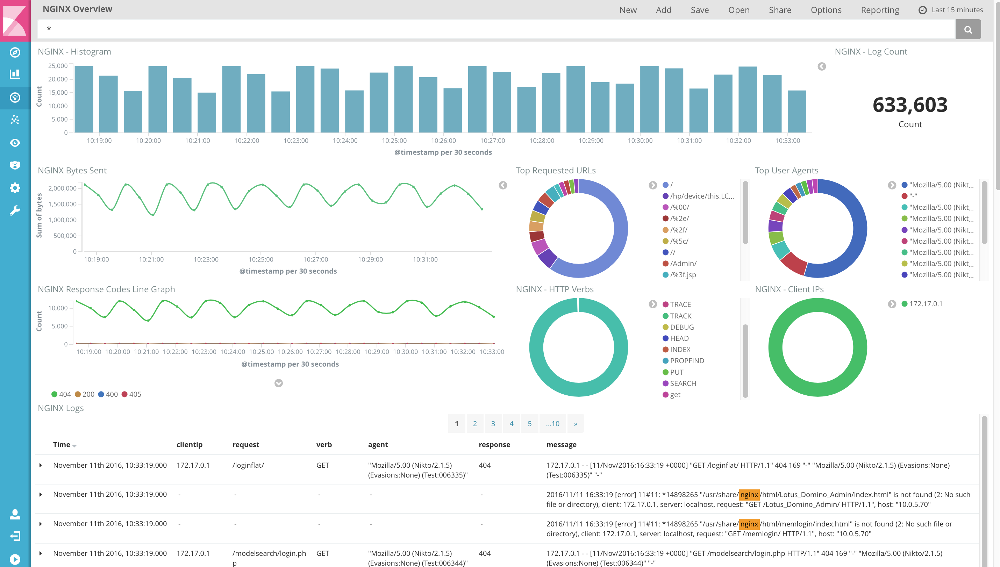

# Overview

**Note:** There's a [Quick Start Guide here](./docs/quick-start-guide.md) for the impatient.

While it is easy for people to use Logstash to gather logs, the challenge comes in when you want to start mining those logs for real insight into what your systems are doing. This repo provides branches with pre-built log parsers and Kibana dashboards, ready for use in your ELK deployment (more on this later).

The `master` branch is a simple bit of pre-canned config that:

1. Enables a Logstash syslog input on port 5514
2. Ships received logging to your ElasticSearch server

This creates a syslog "proxy" which makes trying out Logstash simple, as most anything from an OS to network gear can ship syslog.

While this gets you started on your ELK journey, the real value comes from parsing those logs and building dashboards to gain insight as to what the logs telling you. 

For example, here is what the default "Discover" page in Kibana looks like for NGINX logs:

There is definitely value in being able to search logs across all of the NGINX servers. But, deeper insights are difficult - if not impossible - to tease out of plain log aggregation and search.

Now, let's look at a dashboard that takes advantage of parsed NGINX logs:

Using the same set of logs as we saw above, we can see valuable information, such as: 

* How many bytes are being sent in response to queries
* Graphs showing how many requests received a 404 vs 500 vs 200 response
* The most commonly-requested URLs

# Branches:

As mentioned above, the `master` branch contains configuration for a simple "syslog proxy"-type Logstash deployment. The different branches in this repo expand on this by adding pre-built parsers and dashboards for common log types, such as:

* feature/nginx-parser: Parses standard NGINX logs to pull out interesting data from the logs, including:
	* HTTP response codes
	* HTTP verbs
	* Requested URL
	* Response payload
	* User agent
* feature/apache-parser: Same as with the NGINX logs
* feature/rmq-metrics-ingest: Logstash polls the RabbitMQ Management APIs to grab various queue, vhost, server, etc metrics, which are then put into Elasticsearch for visualiation in Kibana

In the `docs` directory for each of these branches you will find details on what information is parsed, screenshots of the dashboards, requirements, etc.

Also, each of these branches has a `kibana` directory which contains a JSON file defining the search, visualizations, and dashboard for that flavor of logging. The documention in the `docs` directory covers how to upload these into Kibana once you start collecting the corresponding logs.

# Usage options

This repo allows us to cover a couple of different use cases:

1. The Logstash configuration in `config/logstash/` can be used with a standard Logstash installation
2. The Dockerfile can be used to "bake in" the Logstash configuration, allowing for a container-based approach to installing Logstash

Pro-tip: you can test via netcat (`nc`) like so: 

`nc -w0 -u 127.0.0.1 5514 <<< "Testing 1,2,3..."`)

# Option 1: Using Config with Native Logstash

We will presume that you have already installed Logstash, but [read here](https://www.elastic.co/downloads/logstash) if you need help with that). 

Once installed, you can take the contents of `config/logstash` from this repo and copy them to `/etc/logstash` on the server(s) where Logstash is running, then restart Logstash.

# Option 2: Logstash client deployment via Docker Hub-hosted image

There is a pre-built Docker image - based on the Dockerfile in this repo - hosted as [ccfoss/logstash-syslog-proxy](https://hub.docker.com/r/ccfoss/logstash-syslog-proxy/). In fact, there are tagged images for the other branches in this repo, as well. 

The container needs to be able to resolve the host "elasticsearch," which you can do by using the `add-host` option in your `docker run` command. 

For example, if your Elasticsearch endpoint's IP address was 10.2.3.4, you would run the container like so: `docker run --name logstash_agent --add-host=elasticsearch:10.2.3.4 -p 5514:5514/udp ccfoss/logstash-syslog-proxy`

Logstash will run with the following config:

1. Listens on UDP 5514 for syslog messages 
2. Ships any logging to the ElasticSearch instance

# Option 2.1: Use Dockerfile to build a new Docker image

If you want to have the same Logstash config on all clients, you might find it simpler to just create new Docker images with the required configuration baked right in. This means you do not have to ship the configuration around with the Dockerfile. It also means you can update the configuration by:

1. Updating the Logstash configuration in ./config/logstash/conf.d
2. Using `docker build` to update the image, followed by `docker push` to push the images
3. Stop, remove, and re-deploy the container using the latest image

This can change your Logstash upgrades and/or config changes to a single-line command: `docker stop logstash_agent; docker rm logstash_agent; docker pull myrepo/my-logstash-client:latest; docker run --name logstash_agent <your_repo/image_name>`

The build/push process goes like this:

1. Make any changes you wish to the configuration in ./config/logstash/conf.d directory.
2. Once done with config changes, run `docker build -t <your_repo/image_name> .`
3. Optionally, test your image by running it `docker run -it --rm <your_repo/image_name>`
4. Once satisfied, upload your image by running `docker push <your_repo/image_name>`

From there, you can run the `docker stop/rm/pull/run` one-liner listed above. 
